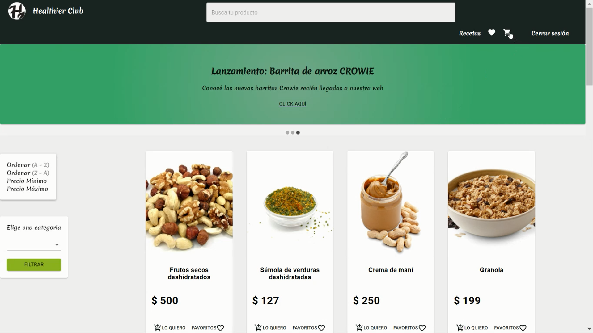
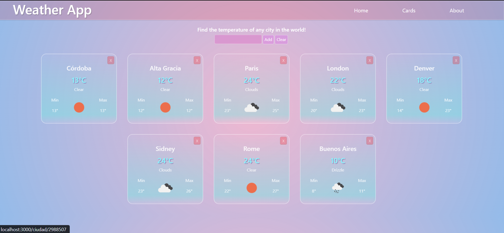
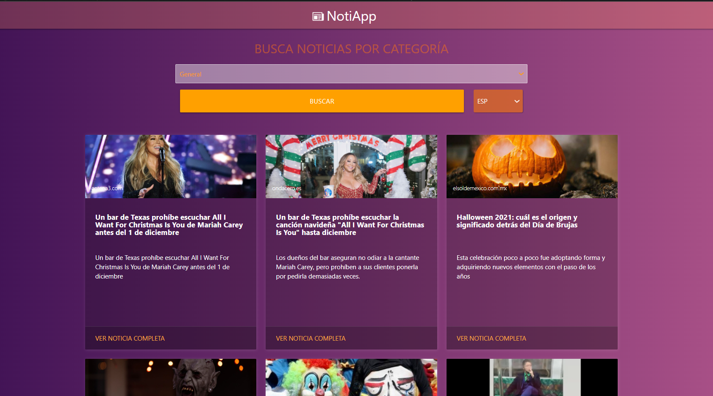
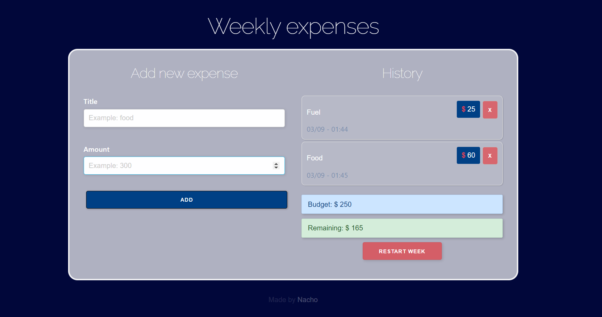
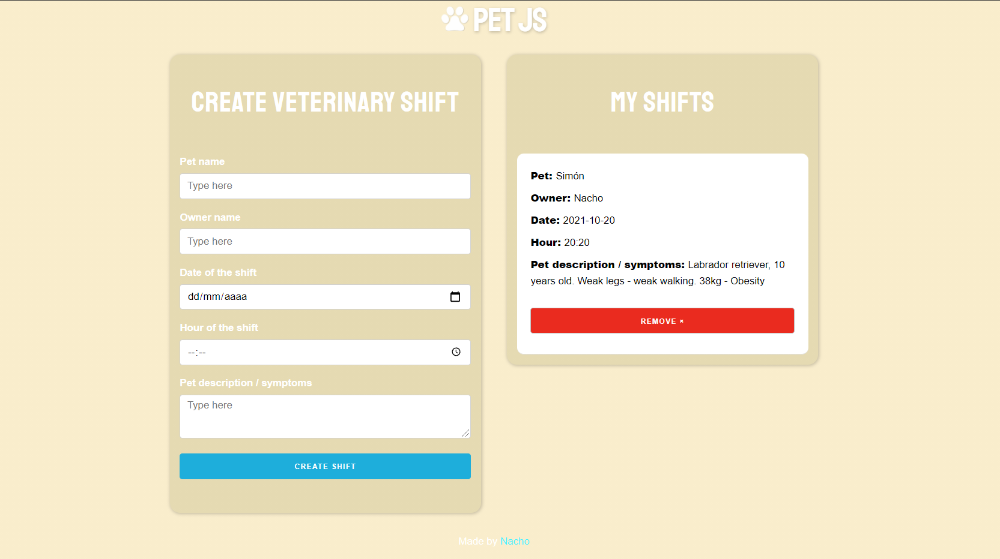

---

  
    JavaScript
  
    HTML
  
    CSS
  
    React JS
  
    Redux
  
    Node JS

  

  
    Express
  
    PostgreSQL
  
    Sequelize
  
    Material-UI
  
    ECMAScript 6
  
    Python

  

---  

    
    
        

---  

  
   

## Healthier
Ecommerce, group full-stack project. (React - Redux - Node - Sequelize - Express - PostgreSQL - MaterialUI)

  

#### See the presentation video [here](https://www.youtube.com/watch?v=21vTycn4p0A)
#### Also you can check the [repo](https://github.com/Healthier-Group/Healthier)  

---  

## Weather App
Individual front-end project, made with React, fetching data from the [Weather API](https://openweathermap.org/api).

  

#### You can visit this project deployed [here](https://weather-app-pink-seven.vercel.app/)
#### Also you can check the [repo](https://github.com/nchvrgr/weatherApp)
#### And its presentation video [here](https://www.youtube.com/watch?v=QfT3XzXaM6s)  

---

## NotiApp

Front End React app. It shows the most relevant news and filters by categories and languages. 

  

#### You can visit this project deployed [here](https://noti-app-six.vercel.app/)
#### And here is the [repo](https://github.com/nchvrgr/notiApp)

---

## Weekly expenses

A React application to manage weekly expenses, it saves the data locally. (Controlled forms, hooks, localStorage, skeleton)

  

#### You can visit this project deployed [here](https://weekly-expenses.vercel.app/)
#### And here is the [repo](https://github.com/nchvrgr/weeklyExpenses)

---

## Pet JS

React frontend demo project. Application to manage patient shifts in a veterinary. The data is saved locally. (React Forms, React Hooks, localStorage)

  

#### You can visit this project deployed [here](https://admin-pacientes.vercel.app/)
#### And here is the [repo](https://github.com/nchvrgr/admin-pacientes)

#### (More projects coming soon! I'm developing new apps while I'm looking for a job.)

# Contact me! 

WPP: +54 9 3547 61-1196
 
Email: vergarajuanignacio02@gmail.com 